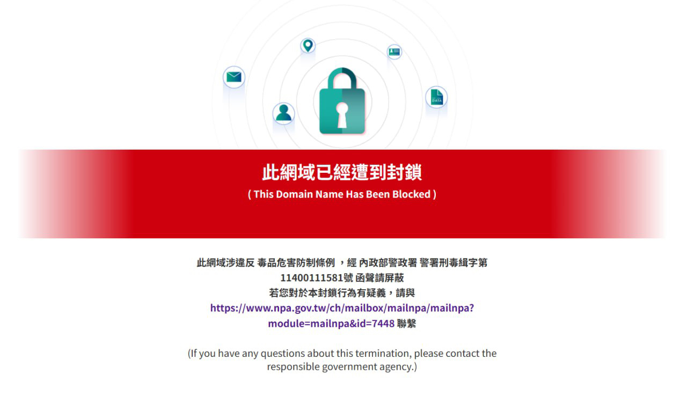

有人說 Blog 比社群媒體更自由，沒有演算法審查、沒有帳號被封的風險。不過，這不代表網路真的沒有審查、封鎖。
政府其實可以讓整個網站對你消失，而你完全不會知道確切原因。

你瀏覽網站時有看過這樣的情況嗎？

所謂「封網」，實際上叫做 [RPZ](https://rpz.twnic.tw/#/technology#main)。簡單來講，就是一個由 TWNIC（財團法人台灣網路資訊中心，負責管理臺灣網路資源）負責維護一個清單，而臺灣業者的 DNS 伺服器去配合停止解析這些網域（網站）。  
上面這張圖片，是在 2025 年時，TWNIC 封鎖了 [Microsoft Azure](https://zh.wikipedia.org/wiki/Microsoft_Azure) 的 azurewebsites.net 網域，導致大量依賴 Azure 的服務下線，[甚至 TWNIC 自己的公文系統都被封鎖](https://www.ithome.com.tw/news/170025)。  

除了 Microsoft Azure 以外，過去也曾經錯誤封鎖如 eu.org（老牌免費子網域申請平台，例如我申請的 <https://maoyue.eu.org>）、[Telegram](https://zh.wikipedia.org/wiki/Telegram) 等知名平台。[來源（Facebook）](https://www.facebook.com/seadog007/posts/%E7%B9%BC-twnic-%E6%8A%8A-searchappeuorgtelegram-telegramorghls-playerhlsplayerorg-%E8%B7%9F-archivetoda/24669481765979124/)  
而這些封鎖，完全不公開、不透明。一般人無從得知 TWNIC 的清單中有哪些網站。只需要行政機關發函給 TWNIC，就會將網域納入封鎖。

現在，政府希望繼續擴權。  
在[修正「兒童及少年福利與權益保障法」草案公告](https://www.sfaa.gov.tw/sfaa/list/detail/5cX/6lz)中，第五十九條第一項第五款要求進行「兒童及少年**適齡識別**及網路隱私保護措施之建立及推動。」  
如果不配合呢？第五十九條第三項提到「主管機關或目的事業主管機關對第一項第五款之提供者，其網際網路內容有害兒童及少年身心發展，應通知先行移除或限制兒童及少年瀏覽。必要時，得**通知網際網路接取服務提供者為限制接取之處置**。」

政府現在想要推動年齡驗證，而提供18禁內容的網站，不配合的網站就會被封鎖。  
這類法案[在歐盟、英國、美國等地都已引發反彈](https://www.wired.com/story/age-verification-is-sweeping-the-us-activists-are-fighting-back/)。實際上，這類法案到頭來不僅侵犯隱私，也侵犯人們的數位權利。  
原本想保護的未成年人，往往能輕易用 VPN 或其他工具繞過封鎖。
這意味著，若要讓管制真正「有效」，政府遲早會面臨一個抉擇，要嘛接受管制形同虛設，要嘛[升級到封鎖 VPN](https://www.theregister.com/security/2026/05/18/mozilla-warns-uk-breaking-vpns-will-not-magically-fix-britains-age-check-mess/5241770)、強制實名驗證等更侵入性的手段。
後者一旦實施，將傷害的就不只是18禁網站的使用者，而是整個社會的數位自由。

[民間司法改革基金會對此草案提出了具體的修改建議](https://www.jrf.org.tw/articles/3211)，值得關注。
問題從來不是要不要保護兒少，而是在什麼樣的監督和透明度下進行。
一個連自己的公文系統都曾被誤封的機構，以及一套非常不透明的封鎖機制，是否真的有資格繼續擴權？
如果社會不開始認真討論這件事，等到法案通過，再回頭看才發現，網路自由已經悄悄縮小了。

