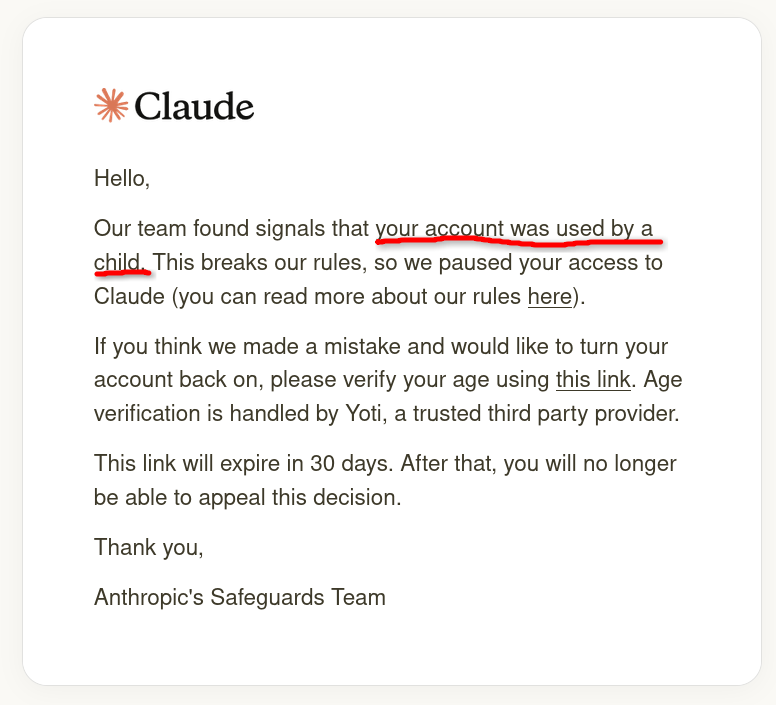

今天，我收到一則 E-mail，讓我哭笑不得：

[Anthropic](https://zh.wikipedia.org/wiki/%E5%AE%89%E7%89%B9%E7%BD%97%E5%8C%B9%E5%85%8B)（營運 [Claude](https://zh.wikipedia.org/wiki/Claude_(%E8%AF%AD%E8%A8%80%E6%A8%A1%E5%9E%8B)) 的公司）認為我是未成年，所以就封鎖我的帳號了。
我苦思冥想，回憶近期對話：不過就是寫點 code、整理研究資料罷了。  
難道我問的問題太簡單了，被認為是國中學生的科展作業嗎？

不過，探討這點也無濟於事，所以我去查看[如何解救我的帳戶](https://support.claude.com/en/articles/15171100-age-assurance-on-claude)。
方式有三種：
1. 掃描臉部
2. 上傳身分證件
3. 透過一個數位身分 APP 認證  

天哪！竟要採取如此侵犯隱私的手段……看來我與 Claude 的緣分已盡。

這個時候，我突然覺得很困惑：為什麼 Anthropic 能夠「偵測」我的年齡？難道他們能夠看見我的對話嗎？  
在 [Privacy Policy \ Anthropic](https://www.anthropic.com/legal/privacy) 中：
> We may use your Inputs and Outputs to train and improve Anthropic AI models, unless you opt out through your account settings. **Even if you opt-out, we will use Inputs and Outputs for model improvement when: (i) your conversations are flagged for safety review** to improve our ability to detect harmful content, enforce our policies, or advance AI safety research, or (ii) you've explicitly reported the materials to us (for example via our feedback mechanisms).  

由此可見，只要 Anthropic 的系統「偵測到異常」，他們即可直接查看你的對話。這就代表，即使他們的系統如實運作（看起來有...嗎？），只要發生類似[臉書「大規模誤判」](https://www.setn.com/News.aspx?NewsID=1856880)的情形（臉書自己說這是系統異常），Anthropic 就可以「合法的」翻閱你的對話紀錄。曾與 AI 討論過公司的機密技術，此刻卻可能變成他們資料庫中的公開檔案，而現在還得被迫實名認證來證明自己不是小孩，這豈不荒謬？而你在創帳號時已經匆匆點過「我同意」了。

雲端服務隨時可以透過他們[躼躼長（lò-lò-tn̂g）](https://sutian.moe.edu.tw/zh-hant/su/29794/)的服務條款，終止用戶的訪問權限，而用戶未必有能力與其抗爭。  
所以，無論如何都要留一個備胎。[LM Studio](https://lmstudio.ai/) 和 [Ollama](https://ollama.com/) 都是很實用的替代品。
這些跑在自己電腦上的模型，只要硬體在，軟體就在那裡。沒有人能遠端關掉它，沒有人能審閱你的對話，沒有人能因為你「看起來像未成年人」而封鎖你的軟體。